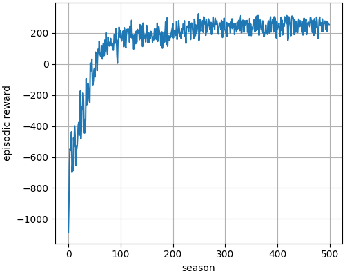
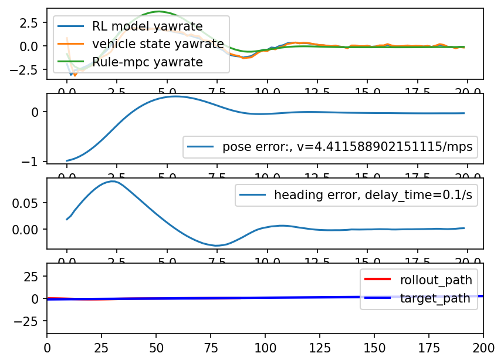
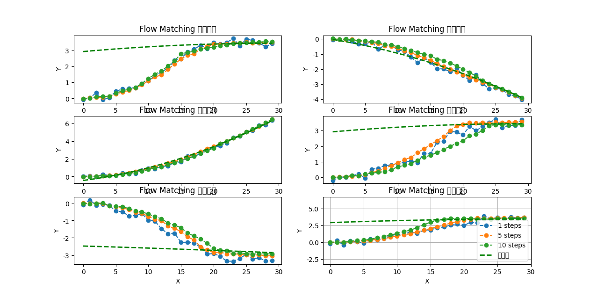

# ppo_lateral_control
ppo (rl) learning for lateral control.

## requirements
    pip3 install -r requirements.txt
## drl demo scripts
    python ppo_tiny.py

## flow match demo scripts
    python flow_match_tiny.py
